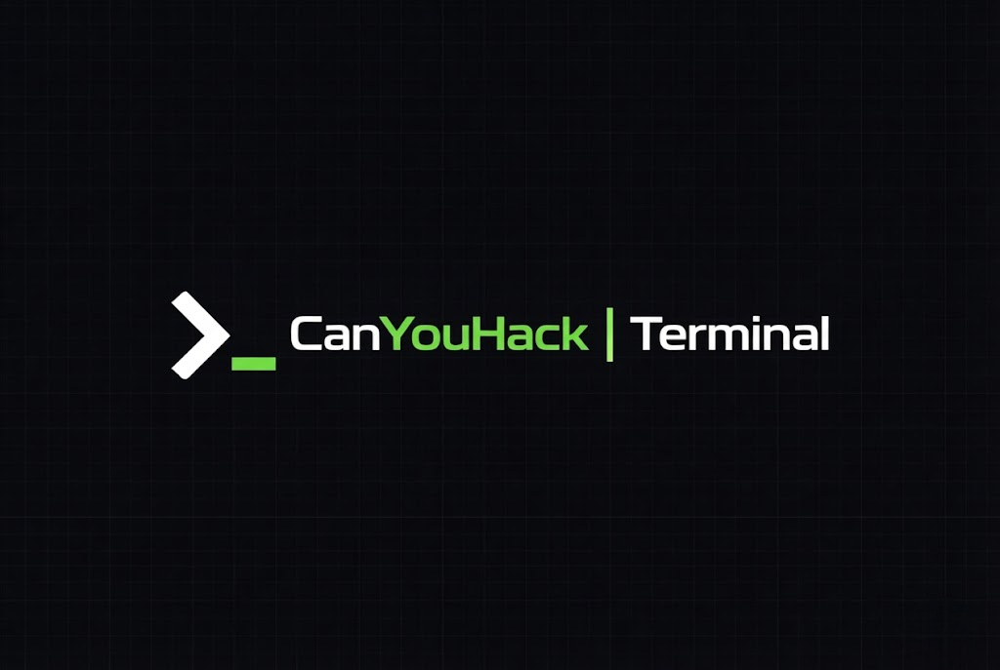
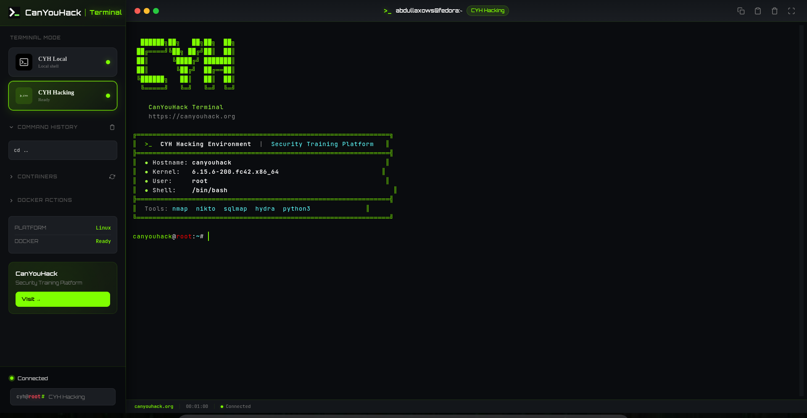

# CYH Terminal

A browser-based terminal emulator with dual-mode support: direct system access and isolated Docker containers for security testing.

**Website**: [canyouhack.org](https://canyouhack.org)

---

## Table of Contents

- [Overview](#overview)
- [Requirements](#requirements)
- [Installation](#installation)
  - [Linux (Ubuntu/Debian)](#linux-ubuntudebian)
  - [Linux (Fedora/RHEL)](#linux-fedorarhel)
  - [macOS](#macos)
  - [Windows](#windows)
- [Running the Application](#running-the-application)
- [Auto-Start Configuration](#auto-start-configuration)
- [Docker Mode](#docker-mode)
- [Mobile Access](#mobile-access)
- [Troubleshooting](#troubleshooting)
- [License](#license)

---
## CYH Terminal



## Overview




## Demo

[Demo video (MP4)](https://github.com/user-attachments/assets/e9af5dad-197d-45f3-9af5-ea4ac533eb8b)


CYH Terminal provides two operating modes:

| Mode | Description |
|------|-------------|
| **Local Mode** | Direct access to the host system terminal with full root privileges |
| **Docker Mode** | Isolated Ubuntu container with pre-installed security tools for safe experimentation |

### Key Features

- 🎥 **Session Recording & Playback** - Record terminal sessions, export as JSON, and replay them
- 🔴 **Live Collaboration** - Share your terminal in real-time with others (View Only, Shared Control, Instructor modes)
- 🔐 **User Authentication** - Secure user accounts with isolated container environments
- 💾 **Persistent Sessions** - Sessions are saved to a local database and can be resumed anytime
- 🔧 **Pre-installed Security Tools** - nmap, sqlmap, hydra, nikto ready to use
- 🔄 **One-click Mode Switch** - Switch between local and Docker environments instantly
- 🐳 **Smart Docker Integration** - Auto-starts Docker Desktop on Windows if needed
- 📱 **Mobile-friendly** - Works on phones and tablets, add to home screen as PWA
- 🖥️ **Cross-platform** - Runs on Linux, macOS, and Windows

**Tech Stack:**
- Backend: Go 1.21+
- Frontend: Vanilla JavaScript with xterm.js
- Container: Docker

---

## Requirements

| Component | Version |
|-----------|---------|
| Go | 1.21 or higher |
| Docker | 20.10 or higher (for Docker Mode) |
| Git | Any recent version |

---

## Installation

### Linux (Ubuntu/Debian)

```bash
# Clone the repository
git clone https://github.com/canyouhack-org/cyh-terminal.git
cd cyh-terminal

# Run the installation script
sudo ./scripts/install-ubuntu.sh
```

**Manual installation:**

```bash
# Install Go
sudo apt update
sudo apt install -y golang-go

# Install Docker
sudo apt install -y docker.io
sudo systemctl enable docker
sudo systemctl start docker
sudo usermod -aG docker $USER

# Build the application
cd backend
go mod tidy
go build -o terminal-server .
```

---

### Linux (Fedora/RHEL)

```bash
# Clone the repository
git clone https://github.com/canyouhack-org/cyh-terminal.git
cd cyh-terminal

# Run the installation script
sudo ./scripts/install-fedora.sh
```

**Manual installation:**

```bash
# Install Go
sudo dnf install -y golang

# Install Docker
sudo dnf install -y dnf-plugins-core
sudo dnf config-manager --add-repo https://download.docker.com/linux/fedora/docker-ce.repo
sudo dnf install -y docker-ce docker-ce-cli containerd.io
sudo systemctl enable docker
sudo systemctl start docker
sudo usermod -aG docker $USER

# Build the application
cd backend
go mod tidy
go build -o terminal-server .
```

---

### macOS

```bash
# Clone the repository
git clone https://github.com/canyouhack-org/cyh-terminal.git
cd cyh-terminal

# Run the installation script
./scripts/install-macos.sh
```

**Manual installation:**

```bash
# Install Homebrew (if not installed)
/bin/bash -c "$(curl -fsSL https://raw.githubusercontent.com/Homebrew/install/HEAD/install.sh)"

# Install dependencies
brew install go
brew install --cask docker

# Build the application
cd backend
go mod tidy
go build -o terminal-server .
```

> **Note:** After installing Docker Desktop, open the application manually for initial setup.

---

### Windows

**Option 1: PowerShell (Recommended)**

Open PowerShell as Administrator:

```powershell
# Install Chocolatey (if not installed)
Set-ExecutionPolicy Bypass -Scope Process -Force
[System.Net.ServicePointManager]::SecurityProtocol = [System.Net.ServicePointManager]::SecurityProtocol -bor 3072
iex ((New-Object System.Net.WebClient).DownloadString('https://community.chocolatey.org/install.ps1'))

# Install dependencies
choco install golang docker-desktop git -y

# Clone and build
git clone https://github.com/canyouhack-org/cyh-terminal.git
cd cyh-terminal\backend
go mod tidy
go build -o terminal-server.exe .
```

**Option 2: Installation Script**

```powershell
.\scripts\install.ps1
```

---

## Running the Application

### Linux

```bash
# Start the server
./scripts/start.sh

# Stop the server
./scripts/stop.sh

# Or run directly
cd backend
./terminal-server
```

### macOS

```bash
# Start the server
./scripts/start-macos.sh

# Stop the server
./scripts/stop-macos.sh
```

### Windows

```cmd
:: Start the server (runs in background)
scripts\start.bat

:: Stop the server
scripts\stop.bat
```

### Development Mode

```bash
cd backend
go run .
```

**Access the terminal:** Open `http://localhost:3333` in your browser.

---

## Auto-Start Configuration

### Linux (systemd)

```bash
# Copy the service file
sudo cp scripts/cyh-terminal.service /etc/systemd/system/

# Enable and start
sudo systemctl daemon-reload
sudo systemctl enable cyh-terminal
sudo systemctl start cyh-terminal
```

**Service management:**

```bash
sudo systemctl status cyh-terminal   # Check status
sudo systemctl stop cyh-terminal     # Stop service
sudo systemctl restart cyh-terminal  # Restart service
sudo journalctl -u cyh-terminal -f   # View logs
```

---

### macOS (LaunchAgent)

The installation script creates a LaunchAgent at `~/Library/LaunchAgents/org.canyouhack.terminal.plist`

```bash
# Enable auto-start on login
launchctl load ~/Library/LaunchAgents/org.canyouhack.terminal.plist

# Disable auto-start
launchctl unload ~/Library/LaunchAgents/org.canyouhack.terminal.plist
```

---

### Windows (Task Scheduler)

**Method 1: Task Scheduler (starts before login)**

```powershell
# Run as Administrator
.\scripts\autostart.ps1 -TaskScheduler
```

**Method 2: Startup Folder (starts on login)**

```powershell
.\scripts\autostart.ps1
```

**Management:**

```powershell
# Check status
Get-ScheduledTask -TaskName "CYH Terminal"

# Start/Stop manually
Start-ScheduledTask -TaskName "CYH Terminal"
Stop-ScheduledTask -TaskName "CYH Terminal"

# Remove auto-start
.\scripts\autostart.ps1 -Remove
```

---

## Docker Mode

Docker Mode provides an isolated Ubuntu container with security tools pre-installed.

**Prerequisites:**
- Docker must be installed
- **Windows**: The application will automatically attempt to start Docker Desktop if it's not running.
- **Linux**: User must be in the `docker` group.

**Available Tools:**

| Category | Tools |
|----------|-------|
| Network | nmap, netcat, tcpdump, ping |
| Web | nikto, sqlmap, curl, wget, dirb |
| Password | hydra, john, hashcat |
| Development | python3, pip, git, gcc, make, vim, nano |

**Building the Docker image:**

```bash
cd docker
docker build -t cyh-terminal .
```

---

## Live Collaboration

CYH Terminal enables real-time collaboration for teaching, debugging, or pair programming.

### Features
- **Real-time Streaming**: Low-latency terminal streaming via WebSockets.
- **Multiple Modes**:
  - **View Only**: Spectators can watch but not interact.
  - **Shared Control**: Viewers can type commands (great for pair programming).
  - **Instructor Mode**: Only the host can type, but can grant temporary control to students.
- **Instant Sharing**: Generate a unique link to share your session instantly.
- **Viewer Management**: See who is connected and manage their permissions on the fly.

### How to use
1. Start a session.
2. Click the **Share** button in the header.
3. Select the permission mode.
4. Copy the link and send it to your collaborators.

---

## User Authentication

The system supports multi-user environments with secure authentication.

- **User Accounts**: Sign up and log in to save your sessions and preferences.
- **Isolated Environments**: Each user gets their own prefixed Docker containers (e.g., `cyh_username_container`).
- **Session History**: All your past sessions are saved to a local SQLite database and can be resumed or replayed later.

---

## Mobile Access

1. Start the server on your computer
2. Find your local IP address:
   - Linux/macOS: `hostname -I` or `ifconfig`
   - Windows: `ipconfig`
3. Open `http://YOUR_IP:3333` on your mobile device

**Add to Home Screen:**
- iOS: Safari > Share > Add to Home Screen
- Android: Chrome > Menu > Add to Home Screen

---

## Session Recording

CYH Terminal automatically records all session activity to a local database for history and resumption. You can also manually record specific segments to export as JSON.

### Automatic Recording
Every command and output is saved to the internal database. You can view your session history and resume previous sessions from the "Sessions" menu.

### Manual Recording & Export

### Recording Controls

| Button | Function |
|--------|----------|
| ⏺️ | Start/Stop recording |
| ⬇️ | Export recording as JSON file |
| ⬆️ | Import recording from JSON file |
| ▶️ | Play/Pause recording playback |

### Usage

1. **Start Recording**: Click the red circle button in the header
2. **Work in Terminal**: Execute your commands as normal
3. **Stop Recording**: Click the button again to stop
4. **Export**: Click the download button to save as `.json` file
5. **Playback**: Import a recording and click play to replay

### Recording Format

Sessions are saved as JSON with timestamps:

```json
{
  "version": "1.0",
  "metadata": {
    "title": "Session 2026-01-20",
    "mode": "docker",
    "recordedAt": "2026-01-20T21:00:00Z",
    "duration": 120000
  },
  "events": [
    { "t": 0, "type": "output", "data": "$ " },
    { "t": 1500, "type": "output", "data": "nmap" }
  ]
}
```

---

## Troubleshooting

### Port 3333 is already in use

```bash
# Find the process
lsof -i :3333          # Linux/macOS
netstat -ano | findstr :3333   # Windows

# Kill it
kill $(lsof -ti:3333)  # Linux/macOS
taskkill /PID <pid> /F # Windows
```

### Permission denied on scripts

```bash
chmod +x scripts/*.sh
```

### Docker mode not working

```bash
# Check if Docker is running
sudo systemctl status docker

# Start Docker
sudo systemctl start docker

# Add user to docker group
sudo usermod -aG docker $USER
# Log out and back in for changes to take effect
```

### WebSocket connection failed

```bash
# Verify server is running
curl http://localhost:3333

# Check firewall (Linux)
sudo ufw allow 3333/tcp

# Check firewall (Windows)
netsh advfirewall firewall add rule name="CYH Terminal" dir=in action=allow protocol=tcp localport=3333
```

---

## License

MIT License

Copyright (c) 2026 CanYouHack

Permission is hereby granted, free of charge, to any person obtaining a copy of this software and associated documentation files (the "Software"), to deal in the Software without restriction, includin[...]

The above copyright notice and this permission notice shall be included in all copies or substantial portions of the Software.

THE SOFTWARE IS PROVIDED "AS IS", WITHOUT WARRANTY OF ANY KIND, EXPRESS OR IMPLIED, INCLUDING BUT NOT LIMITED TO THE WARRANTIES OF MERCHANTABILITY, FITNESS FOR A PARTICULAR PURPOSE AND NONINFRINGEMENT[...]
